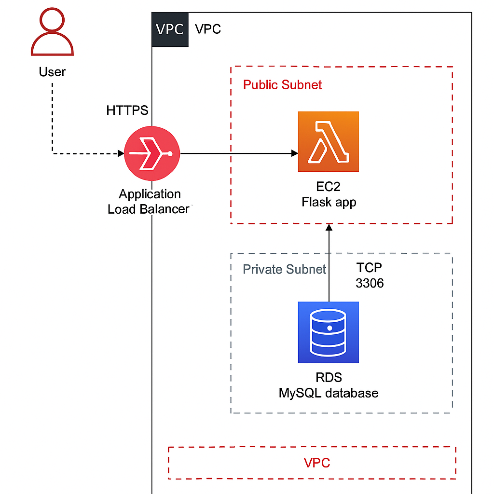
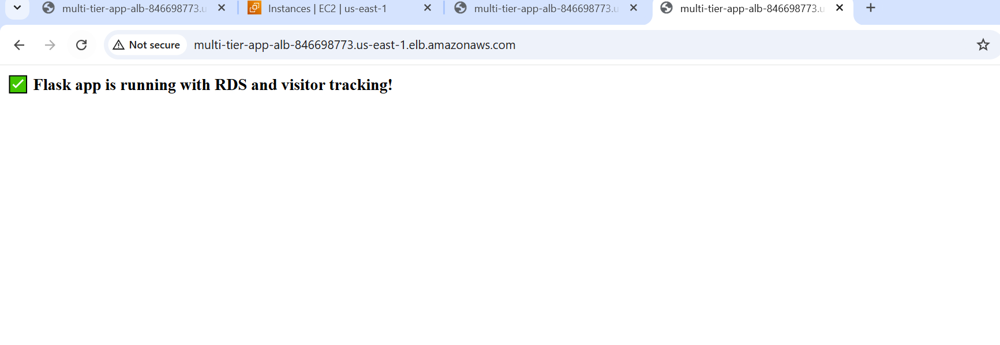
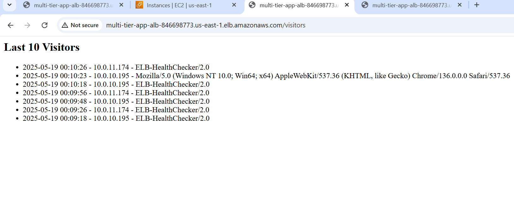

# 🏗️ Multi-Tier Web Application on AWS (Terraform + Flask + RDS + ALB)


---

## 📚 Project Overview

This project deploys a **multi-tier web application** on AWS using **Terraform** as the Infrastructure as Code (IaC) tool. The architecture includes:

- A Flask application running on an EC2 instance in a public subnet.
- An RDS MySQL database in private subnets.
- An Application Load Balancer (ALB) distributing traffic.
- A Bastion host for secure SSH access to private resources (optional phase).

All infrastructure and provisioning steps are fully automated using Terraform.

---

## 📊 Architecture



---

## 🔧 Features

- 🔁 Auto-provisioned network (VPC, subnets, route tables, etc.)
- 🧠 Flask app with visitor tracking logic using RDS
- 🐘 RDS MySQL for persistent storage
- 🌐 ALB for high availability routing
- 🔐 Security Groups for strict access control
- 🛠️ Modular and reusable Terraform code
- 🧪 User-data script to bootstrap EC2 on launch

---

## 🚀 Technologies Used

| Tool         | Purpose                           |
|--------------|-----------------------------------|
| Terraform    | Infrastructure provisioning       |
| AWS EC2      | Hosting Flask web server          |
| AWS RDS      | Backend MySQL database            |
| Flask        | Web framework                     |
| ALB          | Load balancing between instances  |
| Bash         | EC2 initialization via user-data  |

---

## 📸 Screenshots

### ✅ Home Page
Shows successful Flask app + RDS connection



### 🧾 Visitor Tracker
Logs IP and browser info to MySQL



---

## 🪛 Usage

### Prerequisites

- AWS CLI configured with access keys
- Terraform CLI installed
- Key Pair created in AWS EC2 (e.g., `terraform-key`)
- Update `terraform/variables.tf` with your values (e.g., RDS password, key name)

### Steps

```bash
cd terraform/
terraform init
terraform apply
```

After deployment, visit the ALB DNS output to test the app:

```
Outputs:
alb_dns_name = http://multi-tier-app-alb-xxxxxxxx.us-east-1.elb.amazonaws.com
```

---
## Troubleshooting & Lessons Learned

### Common Errors We Encountered

| Issue                                 | Resolution                                                                              |
| ------------------------------------- | --------------------------------------------------------------------------------------- |
| `InvalidKeyPair.NotFound`             | Make sure your EC2 key pair exists in AWS and is correctly referenced in `key_name`.    |
| `DependencyViolation` when destroying | Ensure no resources (e.g. ENIs or SGs) are still attached. Clean up manually if needed. |
| Flask app not persisting              | Verified app is launched with `nohup` and logs written to `app.log`.                    |
| RDS `/visitors` route returns 500     | Caused by closing an undeclared `cursor`. Fixed by rewriting exception logic properly.  |

### Tips

* Avoid duplicate resource blocks or variable names
* Wait for EC2 and RDS to fully provision before testing
* Confirm security groups allow traffic on port 5000 (EC2) and port 3306 (RDS)
---

## 📂 File Structure

```
multi-tier-webapp/
├── Assets/                        # Screenshot images
├── Terraform/                     # Terraform codebase
│   ├── main.tf
│   ├── variables.tf
│   ├── outputs.tf
│   ├── provider.tf
│   └── user-data/
│       └── flask.sh               # Bash script to install Flask app
├── Architecture.png              # AWS architecture diagram
├── LICENSE
├── .gitignore
└── README.md
```

---

## 🪪 License

This project is licensed under the MIT License. See [LICENSE](LICENSE) for details.

---

## ✍️ Author

Roberto Cardenas – *Cloud Engineer Portfolio Project*  
GitHub: [roberto-a-cardenas](https://github.com/roberto-a-cardenas)